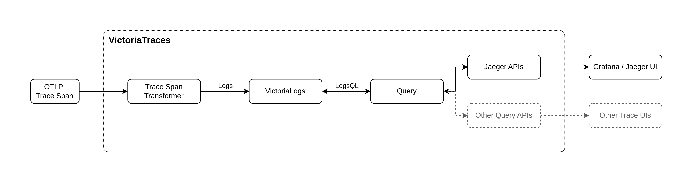

---
build:
  list: never
  publishResources: false
  render: never
sitemap:
  disable: true
---

VictoriaTraces is an open-source, user-friendly database designed for storing and querying distributed [tracing data](https://en.wikipedia.org/wiki/Tracing_(software)),
built by the [VictoriaMetrics](https://github.com/VictoriaMetrics) team.

## Prominent features

VictoriaTraces provides the following prominent features:

- It is resource-efficient and fast. It uses up to [**3.7x less RAM and up to 2.6x less CPU**](https://victoriametrics.com/blog/dev-note-distributed-tracing-with-victorialogs/) than other solutions such as Grafana Tempo.
- VictoriaTraces' capacity and performance scales linearly with the available resources (CPU, RAM, disk IO, disk space). Also, it can scale horizontally to many nodes in [cluster mode](https://docs.victoriametrics.com/victoriatraces/cluster/).
- It has no additional storage dependencies (such as object storage or external databases like ClickHouse and Elasticsearch) for production readiness.
- It accepts trace spans in the popular [OpenTelemetry protocol](https://opentelemetry.io/docs/specs/otel/protocol/)(OTLP).
- It provides [Jaeger Query Service JSON APIs](https://www.jaegertracing.io/docs/2.6/apis/#internal-http-json)
  to integrate with [Grafana](https://grafana.com/docs/grafana/latest/datasources/jaeger/) or [Jaeger Frontend](https://www.jaegertracing.io/docs/2.6/frontend-ui/).
- It supports alerting - see [these docs](https://docs.victoriametrics.com/victoriatraces/vmalert/).

If you want to play with the VictoriaTraces demo, simply go to our [Grafana playground](https://play-grafana.victoriametrics.com/explore) to query and visualize the traces,
and visit the [VictoriaTraces playground](https://play-vtraces.victoriametrics.com/) to see how trace spans are structured and stored.

## Operation

### Install

To quickly try VictoriaTraces, just download the [VictoriaTraces executable](https://github.com/VictoriaMetrics/VictoriaTraces/releases/) or docker image from [Docker Hub](https://hub.docker.com/r/victoriametrics/victoria-traces/) or [Quay](https://quay.io/repository/victoriametrics/victoria-traces) and start it with the desired command-line flags. 
For Kubernetes deployments, we provide both [helm charts](https://docs.victoriametrics.com/victoriatraces/quick-start/#helm-charts) and the [Operator](https://docs.victoriametrics.com/victoriatraces/quick-start/#victoriametrics-operator). See the [Quick Start guide](https://docs.victoriametrics.com/victoriatraces/quick-start/) for more information.

### How to build from sources

Building from sources is reasonable when developing additional features specific to your needs or when testing bugfixes.

{}

Clone VictoriaTraces repository:

```bash
git clone https://github.com/VictoriaMetrics/VictoriaTraces.git;
cd  VictoriaTraces;
```

#### Build binary with go build

1. [Install Go](https://golang.org/doc/install).
2. Run `make victoria-traces` from the root folder of [the repository](https://github.com/VictoriaMetrics/VictoriaTraces).
   It builds `victoria-traces` binary and puts it into the `bin` folder.

#### Build binary with Docker

1. [Install docker](https://docs.docker.com/install/).
2. Run `make victoria-traces-prod` from the root folder of [the repository](https://github.com/VictoriaMetrics/VictoriaTraces).
   It builds `victoria-traces-prod` binary and puts it into the `bin` folder.

#### Building docker images

Run `make package-victoria-traces`. It builds `victoriametrics/victoria-traces:<PKG_TAG>` docker image locally.
`<PKG_TAG>` is auto-generated image tag, which depends on source code in the repository.
The `<PKG_TAG>` may be manually set via `PKG_TAG=foobar make package-victoria-traces`.

The base docker image is [alpine](https://hub.docker.com/_/alpine) but it is possible to use any other base image
by setting it via `<ROOT_IMAGE>` environment variable.
For example, the following command builds the image on top of [scratch](https://hub.docker.com/_/scratch) image:

```sh
ROOT_IMAGE=scratch make package-victoria-traces
```

{}

### Configure VictoriaTraces

VictoriaTraces is configured via command-line flags.
All the command-line flags have sane defaults, so there is no need in tuning them in general case.
VictoriaTraces runs smoothly in most environments without additional configuration.

Pass `-help` to VictoriaTraces in order to see the list of supported command-line flags with their description and default values:

```bash
/path/to/victoria-traces -help
```

The following command-line flags are used the most:

- `-storageDataPath` - VictoriaTraces stores all the data in this directory. The default path is `victoria-traces-data` in the current working directory.
- `-retentionPeriod` - retention for stored data. Older data is automatically deleted. Default retention is 7 days.

You can find the list of the [command-line flags](#list-of-command-line-flags).

## High Availability

### High Availability (HA) Setup with VictoriaTraces Single-Node Instances

This schema outlines how to configure a High Availability (HA) setup using VictoriaTraces Single-Node instances. The setup consists of the following components:

- **Trace Collector**: The trace collector should support multiplexing incoming data to multiple outputs (destinations). Popular trace collector like [the OpenTelemetry collector](https://opentelemetry.io/docs/collector/) already offer this capability. Refer to their documentation for configuration details.

- **VictoriaTraces Single-Node Instances**: Use two or more instances to achieve HA.

- **[vmauth](https://docs.victoriametrics.com/victoriametrics/vmauth/#load-balancing) or Load Balancer**: Used for reading data from one of the replicas to ensure balanced and redundant access.


## Monitoring

VictoriaTraces exposes internal metrics in Prometheus exposition format at `http://<victoria-traces>:10428/metrics` page.
It is recommended to set up monitoring of these metrics via VictoriaMetrics
(see [these docs](https://docs.victoriametrics.com/victoriametrics/single-server-victoriametrics/#how-to-scrape-prometheus-exporters-such-as-node-exporter)),
vmagent (see [these docs](https://docs.victoriametrics.com/victoriametrics/vmagent/#how-to-collect-metrics-in-prometheus-format)) or via Prometheus.

We recommend installing Grafana dashboard for [VictoriaTraces single-node](https://grafana.com/grafana/dashboards/24136) or [cluster](https://grafana.com/grafana/dashboards/24134).

We recommend setting up [alerts](https://github.com/VictoriaMetrics/VictoriaTraces/blob/master/deployment/docker/rules/alerts-vtraces.yml)
via [vmalert](https://docs.victoriametrics.com/victoriametrics/vmalert/) or via Prometheus.

VictoriaTraces emits its own logs to stdout. It is recommended to investigate these logs during troubleshooting.

## Backup and restore

VictoriaTraces stores data into independent per-day partitions. Every partition is stored in a distinct directory under `<-storageDataPath>/partitions/` directory.
It is safe to create a backup of separate partitions with the [`rsync`](https://en.wikipedia.org/wiki/Rsync) command.

The files in VictoriaTraces have the following properties:

- All the data files are immutable. Small metadata files can be modified.
- Old data files are periodically merged into new data files.

Therefore, for a complete **backup** of some per-day partition or a set of partitions, you need to run the `rsync` command **twice**.

```sh
# example of rsync to remote host
rsync -avh --progress --delete <path-to-victoriatraces-data> <username>@<host>:<path-to-victoriatraces-backup>
```

The `--delete` option is required in the command above, since it ensures that the backup contains the full copy of the original data and doesn't contain superfluous files.

The first `rsync` will sync the majority of the data, which can be time-consuming.
As VictoriaTraces continues to run, new data is ingested, potentially creating new data files and modifying metadata files.

The second `rsync` **requires a brief detaching of the backed up partitions** to ensure all data and metadata files are consistent and are no longer changing.
See [how to detach and attach partitions without the need to stop VictoriaTraces](#partitions-lifecycle).
This `rsync` will cover any changes that have occurred since the last `rsync` and should not take a significant amount of time.

To **restore** from a backup, simply `rsync` the backup from a remote location to the original partition directories and then [attach them](#partitions-lifecycle)
without the need to restart VictoriaTraces. Another option is to `rsync` the partitions from the backup while VictoriaTraces isn't running and then start VictoriaTraces.
It will automatically discover and open all the partitions under the `<-storageDataPath>/partitions/` directory.

```sh
# example of rsync from remote backup to local
rsync -avh --progress --delete <username>@<host>:<path-to-victoriatraces-backup> <path-to-victoriatraces-data>
```

The `--delete` option is required in the command above, since it ensures that the destination folder contains the full copy of the backup and doesn't contain superfluous files.

It is also possible to use **the disk snapshot** in order to perform a backup. This feature could be provided by your operating system,
cloud provider, or third-party tools. Note that the snapshot must be **consistent** to ensure reliable backup.

## Retention

By default, VictoriaTraces stores trace data with timestamps in the time range `[now-7d, now]`, while dropping data outside the given time range.
E.g. it uses the retention of 7 days. The retention can be configured with `-retentionPeriod` command-line flag.
This flag accepts values starting from `1d` (one day) up to `100y` (100 years). See [these docs](https://prometheus.io/docs/prometheus/latest/querying/basics/#time-durations)
for the supported duration formats.

For example, the following command starts VictoriaTraces with the retention of 8 weeks:

```sh
/path/to/victoria-traces -retentionPeriod=8w
```

See also [retention by disk space usage](#retention-by-disk-space-usage).

VictoriaTraces stores the [ingested](https://docs.victoriametrics.com/victoriatraces/data-ingestion/) trace spans in per-day partition directories.
It automatically drops partition directories outside the configured retention.

VictoriaTraces automatically drops trace spans at [data ingestion](https://docs.victoriametrics.com/victoriatraces/data-ingestion/) stage
if they have timestamps outside the configured retention. A sample of dropped spans is logged with `WARN` message in order to simplify troubleshooting.
The `vt_rows_dropped_total` [metric](#monitoring) is incremented each time an ingested span is dropped because of timestamp outside the retention.
It is recommended to set up the following alerting rule at [vmalert](https://docs.victoriametrics.com/victoriametrics/vmalert/) in order to be notified
when spans with wrong timestamps are ingested into VictoriaTraces:

```metricsql
rate(vt_rows_dropped_total[5m]) > 0
```

By default, VictoriaTraces doesn't accept trace spans with timestamps bigger than `now+2d`, e.g. 2 days in the future.
If you need accepting trace spans with bigger timestamps, then specify the desired "future retention" via `-futureRetention` command-line flag.
This flag accepts values starting from `1d`. See [these docs](https://prometheus.io/docs/prometheus/latest/querying/basics/#time-durations)
for the supported duration formats.

For example, the following command starts VictoriaTraces, which accepts trace spans with timestamps up to a year in the future:

```sh
/path/to/victoria-traces -futureRetention=1y
```

## Retention by disk space usage

VictoriaTraces can be configured to automatically drop older per-day partitions based on disk space usage using one of two approaches:

### Absolute disk space limit

Use the `-retention.maxDiskSpaceUsageBytes` command-line flag to set a fixed threshold. VictoriaTraces will drop old per-day partitions
if the total size of data at [`-storageDataPath` directory](#storage) becomes bigger than the specified limit.
For example, the following command starts VictoriaTraces, which drops old per-day partitions if the total [storage](#storage) size becomes bigger than `100GiB`:

```sh
/path/to/victoria-traces -retention.maxDiskSpaceUsageBytes=100GiB
```

### Percentage-based disk space limit

Use the `-retention.maxDiskUsagePercent` command-line flag to set a dynamic threshold based on the filesystem's total capacity.
VictoriaTraces will drop old per-day partitions if the filesystem containing the [`-storageDataPath` directory](#storage) exceeds the specified percentage usage.
For example, the following command starts VictoriaTraces, which drops old per-day partitions if the filesystem usage exceeds 80%:

```sh
/path/to/victoria-traces -retention.maxDiskUsagePercent=80
```

This approach is particularly useful in environments where the total disk capacity may vary (e.g., cloud environments with resizable volumes)
or when you want to maintain a consistent percentage of free space regardless of the total disk size.

**Important:** The `-retention.maxDiskSpaceUsageBytes` and `-retention.maxDiskUsagePercent` flags are mutually exclusive.
VictoriaTraces will refuse to start if both flags are set simultaneously.

VictoriaTraces usually compresses trace spans by 10x or more times. This means that VictoriaTraces can store more than a terabyte of uncompressed
trace spans when it runs with `-retention.maxDiskSpaceUsageBytes=100GiB` or when using percentage-based retention on a large filesystem.

VictoriaTraces keeps at least two last days of data in order to guarantee that the traces for the last day can be returned in queries.
This means that the total disk space usage may exceed the configured threshold if the size of the last two days of data
exceeds the limit.

The [`-retentionPeriod`](#retention) is applied independently to the disk space usage limits. This means that
VictoriaTraces automatically drops trace spans older than 7 days by default if only a disk space usage flag is set.
Set the `-retentionPeriod` to some big value (e.g. `100y` - 100 years) if trace spans shouldn't be dropped because of time-based retention.
For example:

```sh
/path/to/victoria-traces -retention.maxDiskSpaceUsageBytes=10TiB -retentionPeriod=100y
```

or

```sh
/path/to/victoria-traces -retention.maxDiskUsagePercent=85 -retentionPeriod=100y
```

## Storage

VictoriaTraces stores all its data in a single directory - `victoria-traces-data`. The path to the directory can be changed via `-storageDataPath` command-line flag.
For example, the following command starts VictoriaTraces, which stores the data at `/var/lib/victoria-traces`:

```sh
/path/to/victoria-traces -storageDataPath=/var/lib/victoria-traces
```

VictoriaTraces automatically creates the `-storageDataPath` directory on the first run if it is missing. VictoriaTraces stores trace spans
per every day into a separated subdirectory (aka per-day partition). See [partitions lifecycle](#partitions-lifecycle) for details.

VictoriaTraces switches to cluster mode if `-storageNode` command-line flag is specified:

- It stops storing the ingested trace spans locally in cluster mode. It spreads them evenly among `vtstorage` nodes specified via the `-storageNode` command-line flag.
- It stops querying the locally stored trace spans in cluster mode. It queries `vtstorage` nodes specified via `-storageNode` command-line flag.

See [cluster mode docs](https://docs.victoriametrics.com/victoriatraces/cluster/) for details.

## Partitions lifecycle

The ingested data is stored in per-day subdirectories (partitions) at the `<-storageDataPath>/partitions/` directory. The per-day subdirectories have `YYYYMMDD` names.
For example, the directory with the name `20250418` contains data with [`_time` field](https://docs.victoriametrics.com/victoriatraces/keyconcepts/#time-field) values
at April 18, 2025 UTC. This allows flexible data management.

For example, old per-day data is automatically and quickly deleted according to the provided [retention policy](#retention) by removing the corresponding per-day subdirectory (partition).

VictoriaTraces supports dynamic attach and detach of per-day partitions, by using the following HTTP API endpoints:

- `/internal/partition/attach?name=YYYYMMDD` - attaches the partition directory with the given name `YYYYMMDD` to VictoriaTraces,
  so it becomes visible for querying and can be used for data ingestion.
  The directory must be placed inside `<-storageDataPath>/partitions` and it must contain valid data for the given `YYYYMMDD` day.
- `/internal/partition/detach?name=YYYYMMDD` - detaches the partition directory with the given name `YYYYMMDD` from VictoriaTraces,
  so it is no longer visible for querying and cannot be used for data ingestion.
  The `/internal/partition/detach` endpoint waits until all the concurrently executed queries stop reading the data from the detached partition
  before returning. This allows safe manipulation of the detached partitions by external tools on disk after returning from the `/internal/partition/detach` endpoint.

These endpoints can be protected from unauthorized access via `-partitionManageAuthKey` [command-line flag](#list-of-command-line-flags).

These endpoints can be used for building a flexible per-partition backup / restore schemes as described [in these docs](#backup-and-restore).

These endpoints can be used also for setting up automated multi-tier storage schemes where recently ingested data is stored to VictoriaTraces instances
with fast NVMe (SSD) disks, while historical data is gradually migrated to VictoriaTraces instances with slower, but bigger and less expensive HDD disks.
This scheme can be implemented with the following simple cron job, which must run once per day:

1. To copy per-day partition for the older day stored at NVMe from NVMe to HDD, with the help of [`rsync`](https://en.wikipedia.org/wiki/Rsync).
1. To detach the copied partition from the VictoriaTraces with NVMe.
1. To run the `rsync` on the copied partition again in order sync the possible changes in the partition during the previous copy.
1. To attach the copied partition to the VictoriaTraces with HDD.
1. To delete the copied partition directory from the VictoriaTraces with NVMe.

All the VictoriaTraces with NVMe and HDD disks can be queried simultaneously via `vtselect` component of VictoriaTraces cluster,
since single-node VictoriaTraces instances can be a part of cluster.

## How does it work

VictoriaTraces was initially built on top of [VictoriaLogs](https://docs.victoriametrics.com/victorialogs/), a log database.
It receives trace spans in OTLP format, transforms them into structured logs, and provides [Jaeger Query Service JSON APIs](https://www.jaegertracing.io/docs/2.6/apis/#internal-http-json) for querying.

For detailed data model and example, see: [Key Concepts](https://docs.victoriametrics.com/victoriatraces/keyconcepts/).



Building VictoriaTraces in this way enables it to scale easily and linearly with the available resources, like VictoriaLogs.

## Multitenancy

VictoriaTraces supports multitenancy. A tenant is identified by `(AccountID, ProjectID)` pair, where `AccountID` and `ProjectID` are arbitrary 32-bit unsigned integers.
The `AccountID` and `ProjectID` fields can be set during [data ingestion](https://docs.victoriametrics.com/victoriatraces/data-ingestion/)
and [querying](https://docs.victoriametrics.com/victoriatraces/querying/) via `AccountID` and `ProjectID` request headers.

If `AccountID` and/or `ProjectID` request headers aren't set, then the default `0` value is used.

VictoriaTraces has very low overhead for per-tenant management, so it is OK to have thousands of tenants in a single VictoriaTraces instance.

VictoriaTraces doesn't perform per-tenant authorization. Use [vmauth](https://docs.victoriametrics.com/victoriametrics/vmauth/) or similar tools for per-tenant authorization.

## Security

It is expected that VictoriaTraces runs in a protected environment, which is unreachable from the internet without proper authorization.
It is recommended providing access to VictoriaTraces [data ingestion APIs](https://docs.victoriametrics.com/victoriatraces/data-ingestion/)
and [querying APIs](https://docs.victoriametrics.com/victoriatraces/querying/#http-api) via [vmauth](https://docs.victoriametrics.com/victoriametrics/vmauth/)
or similar authorization proxies.

It is recommended protecting internal HTTP endpoints from unauthorized access:

- `/internal/force_flush` - via `-forceFlushAuthKey` [command-line flag](#list-of-command-line-flags).
- `/internal/force_merge` - via `-forceMergeAuthKey` [command-line flag](#list-of-command-line-flags).
- `/internal/partition/*` - via `-partitionManageAuthKey` [command-line flag](#list-of-command-line-flags).

## List of command-line flags

Pass `-help` to VictoriaTraces in order to see the list of supported command-line flags with their description:

{}
