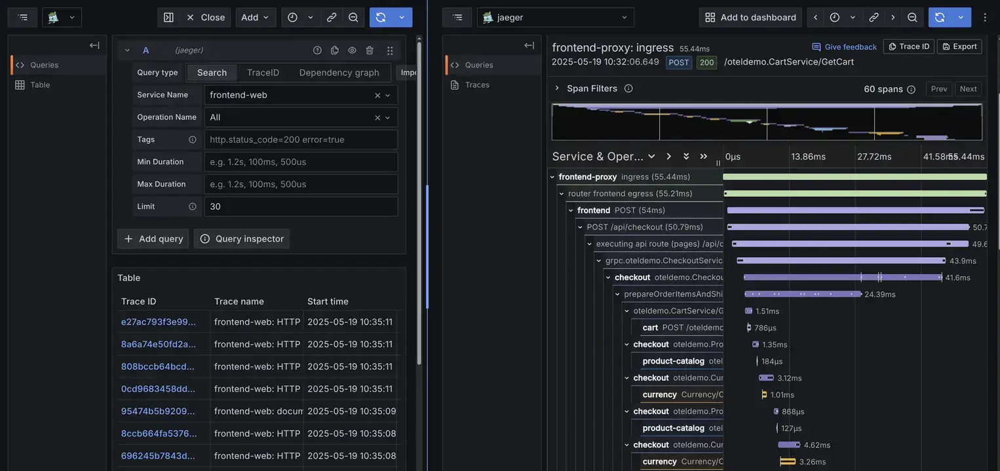

## Jaeger Datasource

[Grafana Jaeger Datasource](https://grafana.com/docs/grafana/latest/datasources/jaeger/) allows you to query and visualize VictoriaTraces data in Grafana.



Simply click "Add new data source" on Grafana, and then fill your VictoriaTraces URL to "Connection.URL".

Supported URL formats:

```sh
# VictoriaTraces Single-node
http://<victoria-traces>:10428/select/jaeger

# VictoriaTraces Cluster - vtselect
http://<vtselect>:10471/select/jaeger
```

Finally, click "Save & Test" at the bottom to complete the process.

## Grafana Tempo Datasource

> Minimum VictoriaTraces version requirement: `v0.9.4`.

The [Grafana Tempo Datasource](https://grafana.com/docs/grafana/latest/datasources/tempo/) allows you to query VictoriaTraces via
[TraceQL](https://grafana.com/docs/tempo/latest/traceql/) and use the [Grafana Traces Drilldown](https://grafana.com/docs/grafana-cloud/visualizations/simplified-exploration/traces/)
plugin for trace exploration. It leverages the Tempo HTTP API implemented by VictoriaTraces.
Refer to [this documentation](https://docs.victoriametrics.com/victoriatraces/querying/#tempo-http-api) for a full list of supported endpoints.

On Grafana, click "Add new data source", then enter your VictoriaTraces URL in the "Connection.URL" field.

Supported URL formats:

```sh
# VictoriaTraces Single-node
http://<victoria-traces>:10428/select/tempo

# VictoriaTraces Cluster - vtselect
http://<vtselect>:10471/select/tempo
```

Finally, click "Save & Test" at the bottom to complete the process.

### Grafana Traces Drilldown

The [Grafana Traces Drilldown](https://grafana.com/docs/grafana-cloud/visualizations/simplified-exploration/traces/) plugin
runs on top of the Tempo datasource configured above. After adding the datasource, navigate to **Explore -> Drilldown -> Traces** (or
open the standalone Traces Drilldown app) and select your VictoriaTraces Tempo datasource.

Drilldown relies on the TraceQL metrics (`/api/metrics/query_range`) endpoint to
render its rate, error, and duration panels, and on various [Tempo query endpoints](https://docs.victoriametrics.com/victoriatraces/querying/#tempo-http-api) for
filtering and exploration. This integration support is experimental, meaning certain panels or TraceQL capabilities may not function identically to native Grafana Tempo.